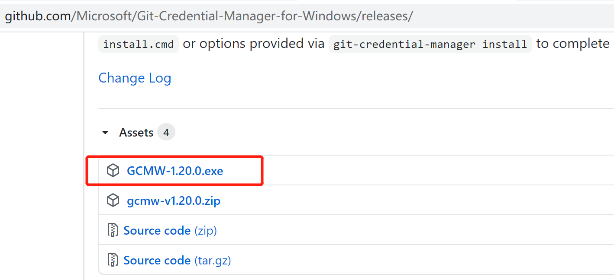
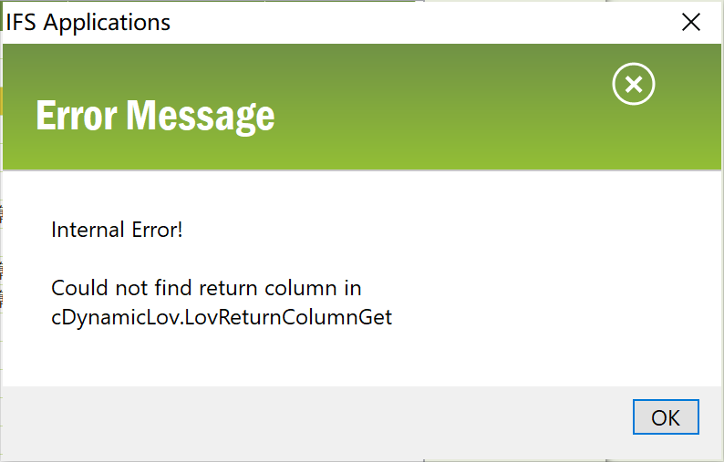
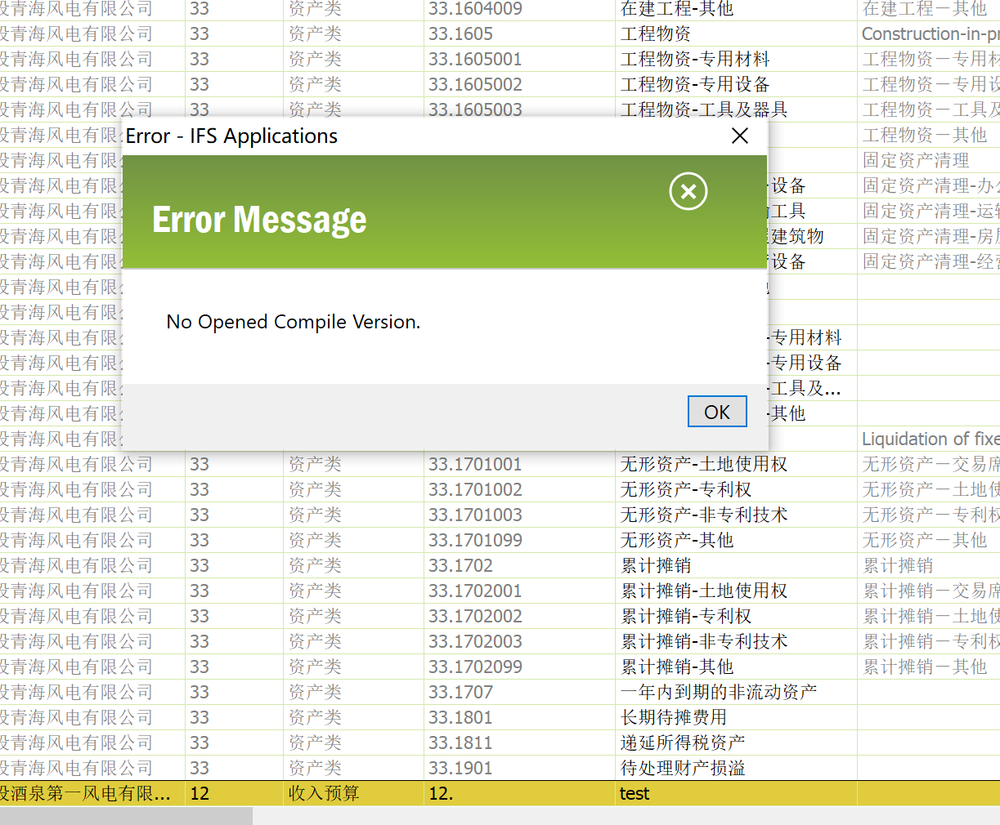
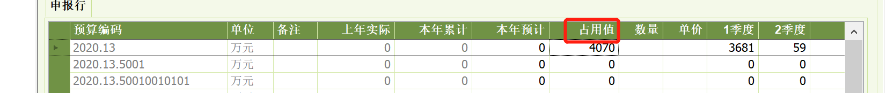

预算申报  frmCbmBudgetRequestFrame_Ext

预算归口审批 frmCbmBudgetReqAdminFrame_Ext

预算管理部门审批  frmCbmBudgetReqMgrFrame_Ext

预算会签 frmCbmBudgetCountersignBy 年度 frmCbmCountersignItem01_Ext 会签maxlength

页面年度（下拉框）更改   ，完成

查验下达金额带入 未带入的解决未带入

年度季度月度预算金额填入走上报流程，查验并解决 

git push  问题

fatal: HttpRequestException encountered.
https://github.com/Microsoft/Git-Credential-Manager-for-Windows/releases/

Cbm_Compile_Item_Full_Admin  删除视图中 from前 objid后的语句

预算科目：frmCbmBudgetCodeBy

类型编码 值列表 选择报错  解决 lov reference 中参数有问题

tbwCbmBudgetCodeBy：预算科目概览 ：Get_Code_Type_Desc参数错误   报错from 视图的时候一般就是在lov reference中写的，

预算科目添加请求  ifsapp.Cbm_Budget_Code_By_API.Add_To_Request(a_ ,b_ );

报错不让添加 ，因为2020年12公司预算没有开。在预算版本中添一个12公司，

预算申报

下达金额灰的所在页面

frmCbmBudgetRequestNew_Ext  

下达金额的SQL Column      Cbm_Compile_Detail_Api.Get_Sum_Value(YEAR, COMPANY, CODE_SEQ)   是包写错了

归口金额frmCbmBudgetReqAdminNew_Ext

管理金额 frmCbmBudgetReqMgrNew_Ext

会签 灰字段   frmCbmBudgetCountersignBy

Approval_Temp_Info_Api.Get_Description(STANDARD_FLOW_ID,null)   没有这个包 加个by 也没有

 占用值改为预算值

frmCbmReqTreeNewLine_Ext申报

frmCbmBudgetReqAdminAppLine_Ext归口审批

frmCbmBudgetReqMgrAppLine_Ext管理部门审批

frmCbmCountersignItem01_Ext会签