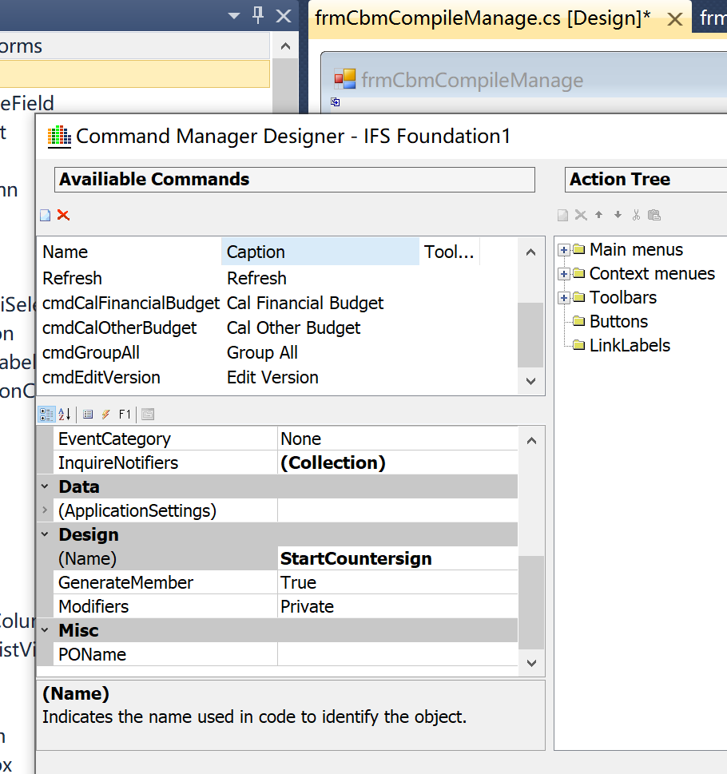
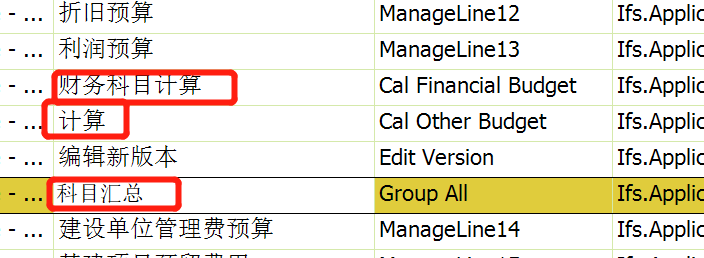
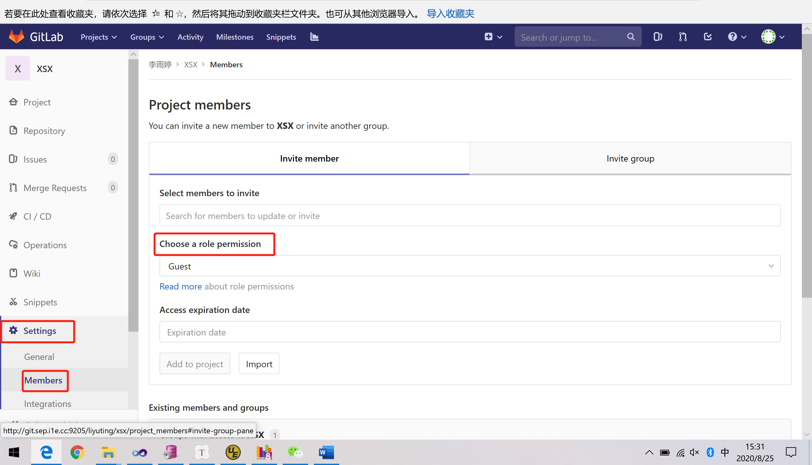

-  connect  by prior 

  level ：代表着节点所在的层

  prior ： 一个运算符，可以放在等号前后，决定着查询时的搜索顺序

  start with ： 表示根节点

  connect by ：关键字，用于连接递归查询的条件

  主要用于父子，祖孙，上下级等层级关系的查询

  { CONNECT BY [ NOCYCLE ] condition [AND condition]... [ START WITH condition ]
  | START WITH condition CONNECT BY [ NOCYCLE ] condition [AND condition]...}

  start with: 指定起始节点的条件

  connect by: 指定父子行的条件关系

  prior: 查询父行的限定符，格式: prior column1 = column2 or column1 = prior column2 and ... ，

  nocycle: 若数据表中存在循环行，那么不添加此关键字会报错，添加关键字后，便不会报错，但循环的两行只会显示其中的第一条

  循环行: 该行只有一个子行，而且子行又是该行的祖先行

  connect_by_iscycle: 前置条件:在使用了nocycle之后才能使用此关键字，用于表示是否是循环行，0表示否，1 表示是

  connect_by_isleaf: 是否是叶子节点，0表示否，1 表示是

  level: level伪列,表示层级，值越小层级越高，level=1为层级最高节点

- trim（）删除空格函数

  trim('字符1' from '字符串2') ，字符1只能是单个字符。

  trim()删除字符串两边的空格。

  ltrim()删除字符串左边的空格。

  rtrim()删除字符串右边的空格。

  trim('字符1' from '字符串2') 分别从字符2串的两边开始，删除指定的字符1。
  trim([leading | trailing | both] trim_char from string)　从字符串String中删除指定的字符trim_char。
  leading:从字符串的头开始删除。
  trailing:从字符串的尾部开始删除。
  borth:从字符串的两边删除。
   tim()只能删除半角空格。

-  lpad函数格式-从左至右填充

  lpad( string, padded_length, [ pad_string ] )

  string  准备被填充的字符串；

  padded_length  填充之后的字符串长度，也就是该函数返回的字符串长度，如果这个数量比原字符串的长度要短，lpad函数将会把字符串截取成从左到右的n个字符;

  pad_string　填充字符串，是个可选参数，这个字符串是要粘贴到string的左边，如果这个参数未写，lpad函数将会在string的左边粘贴空格。

公式&计算逻辑

页面： 预算申报  经营管理部审批

来源页面   申报公式设置 

经营管理部审批  

Logical Unit:	
View:		&AO.CBM_COMPILE
Package:		&AO.CBM_COMPILE_API

页面：frmCbmCompileManage

找到右键挂的菜单：找到翻译

财务科目&计算 LU： CbmCompileLineFormula

财务科目预算：

cmdCalFinancialBudget_Execute

&AO.CBM_COMPILE_LINE_FORMULA_API.Calculate_Compile_Line

计算：

cmdCalOtherBudget_Execute

&AO.CBM_COMPILE_LINE_FORMULA_API.Calculate_Compile_Line

--申报计算

PROCEDURE Calculate_Compile_Line(budget_compile_id_ VARCHAR2,type_ VARCHAR2 DEFAULT 'FIN');

科目汇总LU： cbmCompileLine

科目汇总：

cmdGroupAll_Execute

&AO.CBM_COMPILE_LINE_API.Group_All_Account

--计算汇总申报科目状态以及预算数
PROCEDURE Group_All_Account (
   budget_compile_id_ IN VARCHAR2);

---------------------------------------------------------------------

申报公式设置：

Logical Unit:	cbmCompile
View:		&AO.CBM_COMPILE
Package:		&AO.CBM_COMPILE_API

页面：frmCbmCompileFormula

cmdCalculate_Execute

 &AO.CBM_COMPILE_LINE_FORMULA_API.Calculate_Compile_Line

